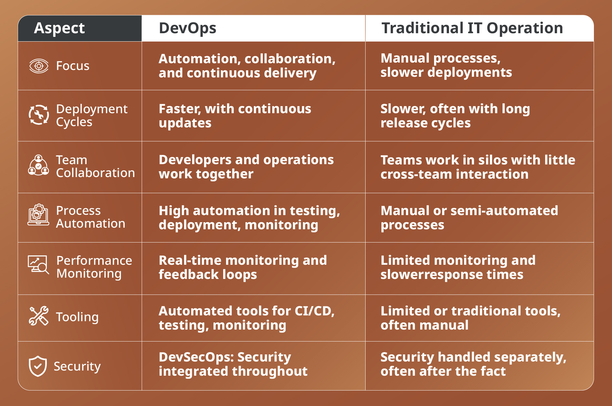

**Phase 1 (Days 1–3): DevOps Foundation**

The first three days build the mindset before introducing tools.

**Day 1 – Introduction to DevOps**
Learning Objectives
Understand DevOps culture.
Learn the role of a DevOps Engineer.
Understand collaboration between Development and Operations.

**Topics**

**What is DevOps?**

DevOps is a collaborative methodology uniting software development (Dev) and IT operations (Ops). It replaces isolated, traditional workflows with a unified, automated lifecycle—aiming to deliver high-quality applications faster, more reliably, and at scale through continuous integration, testing, and deployment (CI/CD).

**Key Concepts:**

Cultural Shift: DevOps breaks down traditional "silos." Instead of writing code and throwing it over the fence for operations teams to manage, developers and operations share responsibility for the product from start to finish.

Automation: Repetitive processes—such as building code, running security scans, and provisioning servers—are automated to reduce human error and speed up delivery times.

Continuous Integration and Continuous Delivery (CI/CD): A core practice where code changes are automatically tested, built, and prepared for release into production without manual bottlenecks.

Infrastructure as Code (IaC): Treating infrastructure setup (like servers and networks) as code, meaning environments can be scaled, cloned, or destroyed instantly via scripts.

**Why DevOps?**
DevOps is adopted to bridge the gap between software developers and IT operations. It enables companies to release software faster, improve system reliability, and reduce deployment failures through continuous automation and collaboration

**Traditional IT vs DevOps**

**Key Benefits of DevOps:**
1. Faster Time to Market. DevOps utilizes CI/CD (Continuous Integration and Continuous Delivery) to break code into smaller, manageable chunks. By testing and releasing updates automatically, organizations can release new features and patches rapidly, keeping them highly competitive.
2. Improved Collaboration and Culture Traditionally, development and operations worked in isolated "silos," which caused friction during code handoffs. DevOps breaks down these barriers. Teams share responsibilities, tools, and objectives, which fosters a transparent, blame-free culture and highly productive workflows.
3. Higher Reliability and Quality. Automating processes—like regression testing, deployment monitoring, and Infrastructure as Code (IaC)—removes human errors inherent in manual updates. If something goes wrong, version control makes rolling back to a stable build almost instantaneous, ensuring consistent system uptime.
4. Accelerated Problem Resolution. Because teams push code in smaller batches, it becomes much easier to trace the exact cause of a bug or system crash. Faster error detection means fixes are resolved in minutes rather than hours, resulting in a significantly smoother user experience.

**DevOps Principles:**
DevOps is a cultural and technical methodology that unifies software development (Dev) and IT operations (Ops). Its primary principles include breaking down organizational silos, automating software lifecycles, and fostering shared accountability to deliver high-quality software safely, faster, and with continuous improvement

**DevOps Engineer Responsibilities:**
Pipeline Management: Build, maintain, and optimize CI/CD pipelines to automate testing and code deployment.
Infrastructure as Code (IaC): Provision and manage infrastructure using tools like Terraform or CloudFormation rather than manual configuration.
Automation: Identify repetitive manual tasks and write automation scripts (using Python, Bash, or Ruby) to improve efficiency.
Monitoring & Troubleshooting: Set up logging and observability dashboards using tools like Prometheus and Grafana to identify performance bottlenecks and resolve production issues proactively.Container Orchestration: Manage application workloads across clusters using Docker and Kubernetes.
Security & Compliance: Embed security best practices (DevSecOps) directly into the deployment pipeline, including automated vulnerability scanning and secrets management

**What is Cloud Computing?**
Cloud computing is the on-demand delivery of IT resources over the Internet with pay-as-you-go pricing. Instead of buying, owning, and maintaining physical data centers and servers, you can access technology services, such as computing power, storage, and databases, on an as-needed basis from a cloud provider like Amazon Web Services (AWS), Microsoft Azure, or Google Cloud.

** On-prem vs Cloud**

**Types of Cloud Computing**
- Private
- Public
- Hybarid

**Demo**
Install VS Code
Install Git
Create a GitHub Account
Install AWS CLI
Install Docker Desktop
Install kubectl
Install Visual Studio Code extensions

**Interview Questions**
What is DevOps?
Why is DevOps needed?
What are the phases of the DevOps lifecycle?
What is Continuous Integration?
What is Continuous Delivery?
What is Continuous Deployment?
