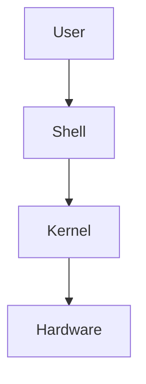

# Day 02 - Linux Fundamentals & File System

## 🎯 Learning Objectives

After completing this lesson, you will understand:

- Linux Architecture
- Linux File System Hierarchy
- Important Directories
- Navigation Commands
- File Operations
- Absolute vs Relative Path

---

## Why Linux?

Nearly 90% of cloud servers run Linux.

AWS EC2
↓
Ubuntu
Amazon Linux
RHEL
CentOS
Most Kubernetes worker nodes also run Linux.

## Linux Architecture

## Linux File System

/

├── bin
├── boot
├── dev
├── etc
├── home
├── lib
├── media
├── mnt
├── opt
├── proc
├── root
├── run
├── srv
├── sys
├── tmp
├── usr
└── var

**Example:**

/etc

Stores configuration files

Examples

/etc/passwd

/etc/hosts

/etc/fstab

/etc/systemd

## Essesntial Commands
pwd
ls
cd
touch
mkdir
cp
mv
rm
cat
less
head
tail
wc
sort
uniq

## Demo

1. Launch Ubuntu EC2
2. SSH
3. Navigate

cd /
ls -lrt
cd /etc
cat hosts

## Linux Administration:

**Architecture:**

User
↓
Group
↓
Permissions
↓
Files

**Commands:**

useradd
usermod
passwd
groupadd
id
whoami
sudo

**Permissions:**
-rwxr-xr--
Owner
Group
Others

**Explain:**
chmod
chown
chgrp

**Demo:**
1. Create Users: 
developer, tester,devops

2. Assign groups

Grant sudo permission.

**systemctl commands:**

systemctl status nginx
systemctl start nginx
systemctl stop nginx
systemctl restart nginx
systemctl enable nginx

**Package Manager:**
OS - Ubuntu

apt
apt update
apt install nginx

OS- Amazon Linux

yum
dnf

**Cron Jobs:**

Example of Backup

0 2 * * * backup.sh

## Real-Time Scenario

Production

Nginx stopped.

Find

Restart

Enable

Verify.

## Assignment

Install

Apache

Enable

Disable

Uninstall

# Interview Questions

Difference

chmod 777

chmod 755

Difference

service

systemctl
