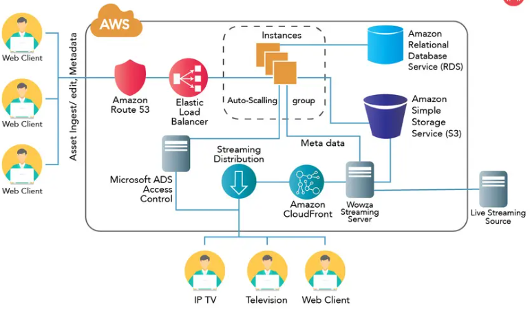
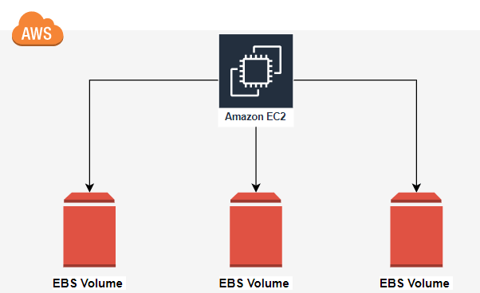
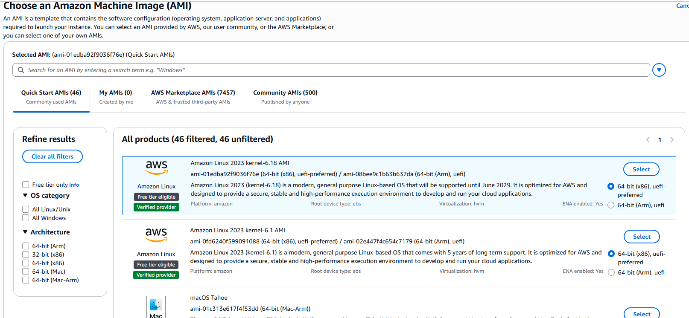

# Day 4 DevOps-Master-Class

# 📀 Amazon EBS & AMI

## 🎯 Learning Objectives

By the end of this session, students will be able to:
- EC2 Basics
- Understand Amazon EBS
- Understand Volume Types
- Create and Attach Volumes
- Extend Disk Space
- Create Snapshots
- Create AMIs
- Restore from Snapshot
- Understand EC2 Boot Process
- Learn Production Backup Strategy

---
## EC2 Basics
EC2 = Virtual Server in AWS Cloud
Launch as many instances you want to serve your workloads
Launch in any AWS region available
Launch different OS servers - Linux, Windows, Ubuntu, CentOS etc
Create, Stop, Terminate, Hibernate, Configure, Monitor
Install required softwares - Web Servers, Application servers, Client software, Graphics software, Gaming applications, anything.
Pay only for capacity used
Various pricing models available

### EC2 in application architecture

## EC2 componenets
- Amazon Machine Image (AMI)
- Instance Type
- Block Storage (Disk)
- SSH key pair
- IP Address (Public/Private/Elastic)
- Security group
- Tags
- IAM Role
- Userdata
- Metadata
- Placement Groups

## Real World Scenario

Imagine a production server.
Ubuntu EC2
↓
Website
↓
Customer Data
↓
Amazon EBS

### Question

If EC2 crashes, How do you recover?
Answer: Snapshot, AMI

# EBS

## What is Amazon EBS? (Elastic Block Store)

Think of EBS as "A virtual hard disk attached to EC2."

### Architecture

### Types of EBS
Type	Use Case
gp3	    General Purpose SSD
io2	    High IOPS Database
st1	    Throughput Optimized HDD
sc1	     Cold Storage

## Amazon Machine Image (AMI)

- Operating system - Linux, Windows and more
- AMI Ownership
Private
Public
Marketplace
- AMIs are constrained to AWS region
- We can copy AMI to other AWS regions
- We can share AMIs with other AWS Account
- Useful for Backup - Restore, Golden image, EC2 in Auto scaling mode

### AMI contains

Operating System
Packages
Configuration
Application
Metadata

### Architecture

EC2

↓

Install

↓

Configure

↓

Create AMI

↓

Launch New EC2

### Difference Snapshot and AMI

| EBS Snapshot    | AMI                        |
| --------------- | -------------------------- |
| Backup Disk     | Backup Entire Server       |
| Volume Only     | Full Instance Template     |
| Faster Recovery | Faster Server Provisioning |

## Hands-on Lab

Student should -

- Launch EC2
- Create New EBS Volume
- Mount Volume
- Store Files
- Create Snapshot
- Delete Files
- Restore Snapshot
- Create AMI
- Launch New Instance

## Exercise 1: Launch EC2 Windows Instance
- Create default VPC (if does not exist)
 VPC -> Your VPCs -> Action -> Create Default VPC)
- Using Windows AMI (Microsoft Windows Server 2019 Base), launch EC2 t2.micro instance in default VPC. 
- Open RDP port (3389) in Security group for Anywhere or MyIP
Wait for 3-4 minutes for Instance to be Running
- EC2 -> Actions -> Get the Windows Password -> Provide your ssh key (.pem) -> Decrypt Password
- Login to instance using Remote Desktop (RDP). Provide Public IP of EC2.
User: Administrator
Password: 

### AWS CLI Demo

Install AWS CLI

$aws configure

Verify

$aws sts get-caller-identity

List Users

$aws iam list-users

List Groups

$aws iam list-groups

### Interview Questions
- What is EBS?
- Difference between gp2 and gp3?
- Difference between Snapshot and Backup?
- What is AMI?
- Can one EBS volume attach to multiple EC2 instances?
- What is Multi-Attach?
- Difference between Root Volume and Data Volume?
- How do you resize an EBS volume?
- Explain Snapshot lifecycle.
- What happens when an EC2 instance is terminated?