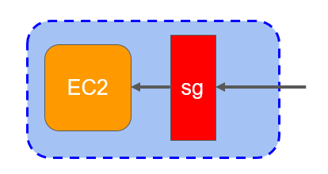
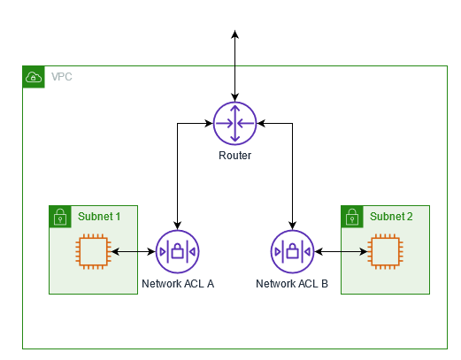

# Day 5 DevOps-Master-Class

# 📀 AWS Security Groups & Network ACLs

## 🎯 Learning Objectives

- Understand AWS network security layers
- Differentiate Security Groups and Network ACLs
- Configure inbound and outbound rules
- Understand Stateful vs Stateless firewalls
- Secure EC2 instances using least-privilege principles
- Troubleshoot connectivity issues
- Apply production security best practices

## Agenda
1. AWS Network Security Overview
2. Security Groups
3. Network ACLs
4. Stateful vs Stateless
5. Rule Evaluation
6. Architecture
7. Hands-on Demo
8. Production Troubleshooting
9. Best Practices
10. Interview Questions


## Why Do We Need Security?

Imagine your company hosts an online banking application.

Without network security:

Internet
     │
     ▼
 EC2 Server

Anyone could try to access SSH, databases, or application ports.
Network security protects your workloads by allowing only the required traffic.

## AWS Network Security Group Architecture

```mermaid
flowchart LR

Internet --> SecurityGroup

SecurityGroup --> EC2




- Virtual Firewall - First level of defence
- Stateful - No need to explicitly allow return traffic
- Works at EC2 and RDS level
- Default - allows all outbound traffic. No inbound traffic.
- Can attach upto 5 security groups to single EC2 instance with 100 rules (in/outbound) per SG
- Can only specify ALLOW rules.
- Deny rules can not be specified
- Changes to rules are in effect immediately

### Security group inbound rules

Example Security Group Rules

| Type  | Port | Source         |
| ----- | ---- | -------------- |
| SSH   | 22   | Your Public IP |
| HTTP  | 80   | 0.0.0.0/0      |
| HTTPS | 443  | 0.0.0.0/0      |


### AWS Network Security Layers
Internet

↓

Internet Gateway

↓

Network ACL (Subnet Level)

↓

Security Group (Instance Level)

↓

EC2 Instance

### Stateful Firewall
Laptop

↓

Port 22

↓

EC2

- Inbound SSH allowed.
- Response traffic is automatically allowed.
- No outbound rule is required for the response.

## Network ACL Overview



A Network ACL protects the entire subnet.

Characteristics:

- Subnet level
- Stateless
- Supports Allow and Deny rules
- Rules processed in ascending order


flowchart LR

Internet

↓

Internet Gateway

↓

NACL

↓

Public Subnet

↓

EC2

### Stateless Firewall

Client

↓

Port 80

↓

NACL

↓

EC2

↓

Response

↓

- NACL checks outbound rule again
- Unlike Security Groups, return traffic must also be explicitly allowed.

## Security Group vs Network ACL
| Feature         | Security Group      | Network ACL                |
| --------------- | ------------------- | -------------------------- |
| Applied To      | EC2 Instance        | Subnet                     |
| Stateful        | Yes                 | No                         |
| Deny Rules      | No                  | Yes                        |
| Default         | Deny Inbound        | Allow/Deny based on rules  |
| Rule Processing | All rules evaluated | Lowest numbered rule first |

### Demo 1 - Create a Security Group
Inbound Rules

SSH (22) → Your IP
HTTP (80) → Anywhere
HTTPS (443) → Anywhere

Launch an EC2 instance using this Security Group.

Verify:
- SSH connection
- Web page access

### Demo 2 - Block SSH

Remove port 22 from the Security Group.

Attempt to connect:

$ ssh ubuntu@<public-ip>

Observe timeout.:
- Restore the rule.
- Reconnect

### Production Best Practices

✅ Allow SSH only from corporate/VPN IPs.

✅ Use Session Manager instead of SSH where possible.

✅ Separate Security Groups by application tier.

✅ Never expose databases to the internet.

✅ Use least-privilege rules.

✅ Enable VPC Flow Logs for auditing.

## Assignment
- Create three Security Groups:
Web-SG
App-SG
DB-SG
- Create a custom Network ACL for the public subnet.
- Block HTTP using the NACL and observe the impact.
- Restore access and document the troubleshooting steps.
- Draw the packet flow from the Internet to the EC2 instance.
