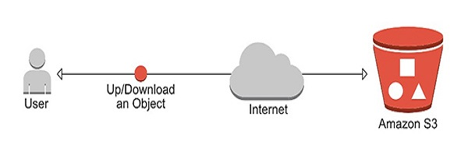
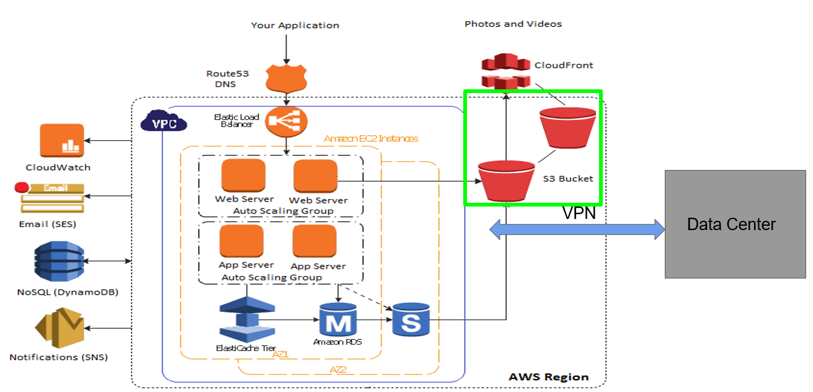
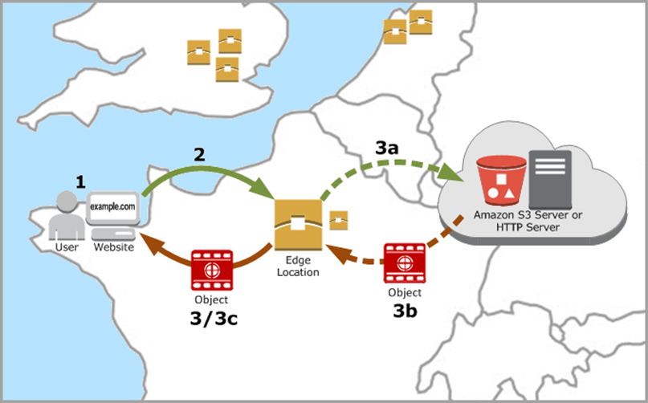

# Day 6 📀 Amazon S3 (Simple Storage Service)
---

# 🎯 Learning Objectives

By the end of this session, students will be able to:

- Understand Amazon S3 Architecture
- Learn Object Storage Concepts
- Create and Manage Buckets
- Understand Bucket Policies & IAM Access
- Configure Versioning
- Enable Static Website Hosting
- Implement Lifecycle Policies
- Understand Storage Classes
- Configure Encryption
- Learn Cross-Region Replication (CRR)
- Perform Real-time DevOps Labs

---

# Agenda

1. What is Amazon S3?
2. S3 Architecture
3. Buckets & Objects
4. Storage Classes
5. Bucket Policies
6. Versioning
7. Static Website Hosting
8. Lifecycle Rules
9. Encryption
10. Cross Region Replication
11. Hands-on Demo
12. Real-world Scenarios
13. Assignment
14. Interview Questions
---

## What is Amazon S3?

Amazon S3 (Simple Storage Service) is an object storage service used to store unlimited amounts of data securely, durably, and with high availability.

- Storage for the Internet
- Store and Retrieve Any amount of data, at any time, from anywhere on the web
- Highly scalable, Reliable, fast and Inexpensive data storage
- Object storage

Examples of data stored in S3:
- Website images
- Application logs
- Backup files
- CI/CD artifacts
- Docker application assets
- CloudFormation templates

## S3 Terminologies



- Region
- Buckets
- Objects
- Keys
- URLs
http://bucket.s3-aws-region.amazonaws.com.
https://awsdevopsmasterclass.com.s3-us-east-1.amazonaws.com/images/header.jpg

## Exercise 1: Create a S3 bucket and upload/download file
Go AWS console -> S3 service
Click “Block Public access (account settings)”  and turn off (if its on)
Create Bucket
Provide unique name for your bucket
Region: Asia Pacific Mumbai
Create
Click on bucket name and get inside bucket
Go to Permissions -> Block Public Access -> Turn off (if its on)
Upload any sample image file to bucket using console
Try to download object -> Should be able to download
Click on image -> Copy URL -> Try to open URL through browser


### Real World Example

Imagine an e-commerce application.

Customer
↓
Website
↓
Product Images
↓
Amazon S3

- Instead of storing images on EC2, store them in S3.

Benefits:

- Lower Cost
- Unlimited Storage
- High Availability
- Better Performance

## Amazon S3 Architecture



## Amazon S3 Components
Amazon S3

│

├── Bucket

│

├── Folder (Logical)

│

├── Object

│

└── Metadata

## Bucket Naming Rules

Examples:
company-devops-backup
student-demo-bucket
my-static-website

### Rules

- Globally unique
- Lowercase only
- No spaces
- 3–63 characters

## Object

Everything stored in S3 is an object.

Example:

resume.pdf

image.png

terraform.zip

backup.sql

index.html

## Storage Classes

| Storage Class              | Use Case                    |
| -------------------------- | --------------------------- |
| Standard                   | Frequently accessed data    |
| Intelligent-Tiering        | Automatic cost optimization |
| Standard-IA                | Infrequent access           |
| One Zone-IA                | Single AZ storage           |
| Glacier Instant Retrieval  | Archive with quick access   |
| Glacier Flexible Retrieval | Long-term archive           |
| Glacier Deep Archive       | Lowest-cost archive         |


## Digram

```mermaid
flowchart LR

Standard --> IA

IA --> Glacier

Glacier --> DeepArchive

Explain cost differences and retrieval times.


### S3 Versioning

Without Versioning
Resume.pdf

↓

Overwrite

↓

Old File Lost


With Versioning

Resume V1

↓

Resume V2

↓

Resume V3

Old versions remain available.


## Demo 1 - Create Bucket

AWS Console

↓

S3

↓

Create Bucket

Name

$ devops-training-bucket

Enable:
- Versioning
- Default Encryption

Upload

index.html

logo.png

resume.pdf

Verify uploads.

## Demo 2 - Static Website Hosting

Create index.html

<html>

<h1>Welcome to DevOps Training</h1>

</html>

Enable

Static Website Hosting

Access website using S3 URL.

```mermaid
flowchart TD

Browser

↓

S3 Website Endpoint

↓

index.html


## Encryption

Types:

- SSE-S3
- SSE-KMS
- SSE-C

Explain which option is commonly used in enterprise environments and why KMS-managed keys are preferred for auditability and access control.

## Amazon Glacier

Archives
Unlimited data storage with upto maximum 40 TB of single archive file size
Immutable
Encrypted
AWS managed archive IDs
How it differs from S3
Lowest storage cost
40 TB archive size vs 5 TB for S3 standard
System generated archive ID
Automatically Encrypted

## AWS CloudFront (CDN)
Global Content Delivery Network service to distribute content  to end users with low latency and high data transfer speeds

### CloudFront Features
Caching of contents at Edge Locations
Reduces load on Web servers
Supports S3, EC2, ELB and on-premise servers as Origin
Supports HTTP, HTTPS, RTMP
Signed URLs, GeoRestriction
Streaming - Adobe, Microsoft IIS, Wowza




## Production Best Practices

✅ Enable Versioning

✅ Enable Encryption

✅ Block Public Access by default

✅ Enable Server Access Logging

✅ Use Lifecycle Policies

✅ Use Bucket Policies instead of Access Keys where appropriate

✅ Enable MFA Delete for sensitive buckets

## Troubleshooting
### Access Denied

Check:

IAM Policy
Bucket Policy
Block Public Access
KMS Permissions

#### Website Not Loading

Check:

index.html exists
Static Website Hosting enabled
Bucket Policy allows read access
Public Access Block settings
Correct endpoint URL

## Hands-on Lab

Student Tasks

Create a bucket
Enable Versioning
Upload multiple files
Configure Static Website Hosting
Create Lifecycle Rule
Create Bucket Policy
Upload using AWS CLI
Download files
Delete files
Restore previous version

## Assignment
Create two S3 buckets:
training-dev
training-prod
Enable Versioning on both.
Upload five files.
Configure a Lifecycle Rule to transition objects to Glacier after 30 days.
Host a static website from one bucket.
Use the AWS CLI to upload and synchronize files.
Document every step with screenshots.