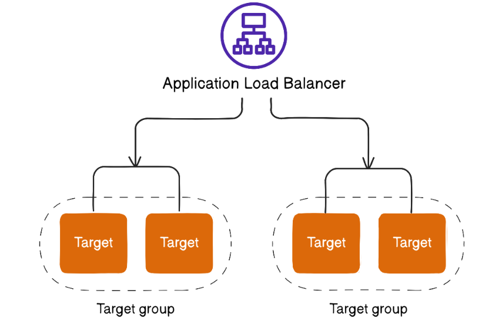
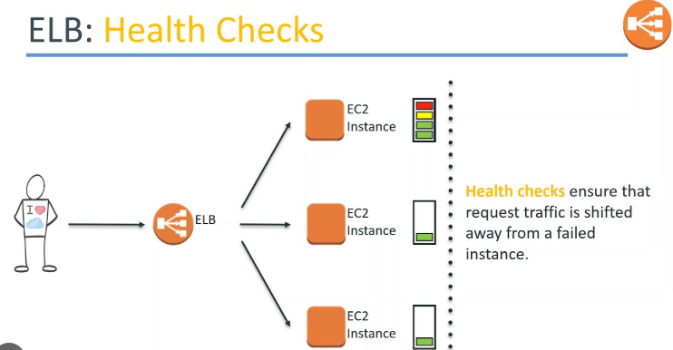
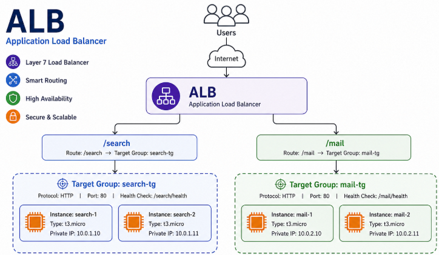
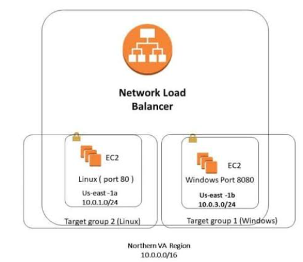

# 📅 Day 6 - 📀 AWS Elastic Load Balancer (ALB & NLB)
---

# 🎯 Learning Objectives

By the end of this session, students will be able to:

- Understand why Load Balancers are required
- Explain Elastic Load Balancer (ELB)
- Differentiate ALB, NLB and GWLB
- Configure Target Groups
- Configure Listeners and Listener Rules
- Understand TLS/SSL Termination
- Configure Health Checks
- Understand Sticky Sessions
- Learn Kubernetes Ingress Integration
- Troubleshoot Production Traffic Issues
- Perform Hands-on Labs

---

# Agenda

1. Why Load Balancer?
2. ELB Overview
3. ALB Architecture
4. NLB Architecture
5. Gateway Load Balancer
6. Target Groups
7. Listeners
8. TLS Termination
9. Health Checks
10. Sticky Sessions
11. Kubernetes Ingress
12. Hands-on Demo
13. Troubleshooting
14. Assignment
15. Interview Questions
---

## Why Load Balancer?

Imagine your application is hosted on a single EC2 instance.

Internet
      │
      ▼
    EC2

If the server crashes, the application becomes unavailable.

Problems:

- Single Point of Failure
- No High Availability
- No Scalability
- No Automatic Failover

## Solution

Use an Application Load Balancer.

Benefits

- High Availability
- Automatic Traffic Distribution
- Health Monitoring
- Zero Downtime
- Auto Scaling Integration

## AWS Elastic Load Balancer Family
| Type                            | Layer   | Best For            |
| ------------------------------- | ------- | ------------------- |
| Application Load Balancer (ALB) | Layer 7 | HTTP / HTTPS        |
| Network Load Balancer (NLB)     | Layer 4 | TCP / UDP / TLS     |
| Gateway Load Balancer (GWLB)    | Layer 3 | Security Appliances |

## AWS ELB Architecture

Explain:

- DNS
- Load Balancer
- Listener
- Target Group
- Health Check

## Application Load Balancer (ALB)

Layer 7 Load Balancer

Supports:

- HTTP
- HTTPS
- WebSockets
- HTTP/2

Features:

- Path-based Routing
- Host-based Routing
- TLS Termination
- Sticky Sessions
- Redirect Rules

#Network Load Balancer (NLB)
Layer 4

Supports:

- TCP
- UDP
- TLS

Architecture

Used for

Gaming
Banking
MQTT
High-performance APIs

## ALB vs NLB
| Feature         | ALB | NLB |
| --------------- | --- | --- |
| OSI Layer       | 7   | 4   |
| HTTP Routing    | ✅   | ❌   |
| Host Routing    | ✅   | ❌   |
| Path Routing    | ✅   | ❌   |
| Static IP       | ❌   | ✅   |
| TLS Termination | ✅   | ✅   |
| TCP/UDP         | ❌   | ✅   |

## Gateway Load Balancer (Overview)

GWLB integrates virtual security appliances.

### Target Groups

Target Groups define where traffic should go.

Supported Targets

EC2
IP Address
Lambda

### Health Checks

ALB continuously verifies application health.

GET /health
↓
200 OK
↓
Healthy

If a server returns 500 or times out, ALB removes it from rotation automatically.

### Listener

A Listener checks incoming requests.

Example

HTTPS :443
↓
Forward
↓

### Target Group

| Port | Protocol |
| ---- | -------- |
| 80   | HTTP     |
| 443  | HTTPS    |

## Kubernetes Ingress

Explain

Ingress
↓
Service
↓
Pods

Mention that the AWS Load Balancer Controller automatically creates an ALB from Kubernetes Ingress resources.

Ingress provides Layer 7 routing for Kubernetes.

## Demo 1 - Create Application Load Balancer

Launch :

- Two EC2 instances

- Install Nginx

Modify home page:

- Server-1

Welcome from Server-1

- Server-2

Welcome from Server-2

- Create
- Target Group
- ALB
- Listener (HTTP :80)

Verify browser refresh alternates between servers.

## Assignment
- Create an ALB with two EC2 instances.
- Configure Target Groups.
- Add an HTTPS Listener.
- Configure HTTP to HTTPS redirection.
- Test Health Checks.
- Create a second Target Group and implement path-based routing (/api).
- Document architecture, screenshots, and observations.

## Interview Questions
- What is an Elastic Load Balancer?
- Difference between ALB and NLB?
- What is a Target Group?
- What is a Listener?
- What is TLS Termination?
- Difference between SSL Passthrough and TLS Termination?
- How does Health Checking work?
- What happens when an EC2 instance becomes unhealthy?
- Explain Sticky Sessions.
- How does Kubernetes Ingress integrate with an ALB?

Reference:
https://portal.tutorialsdojo.com/courses/playcloud-sandbox-aws/lessons/creating-your-first-application-load-balancer/